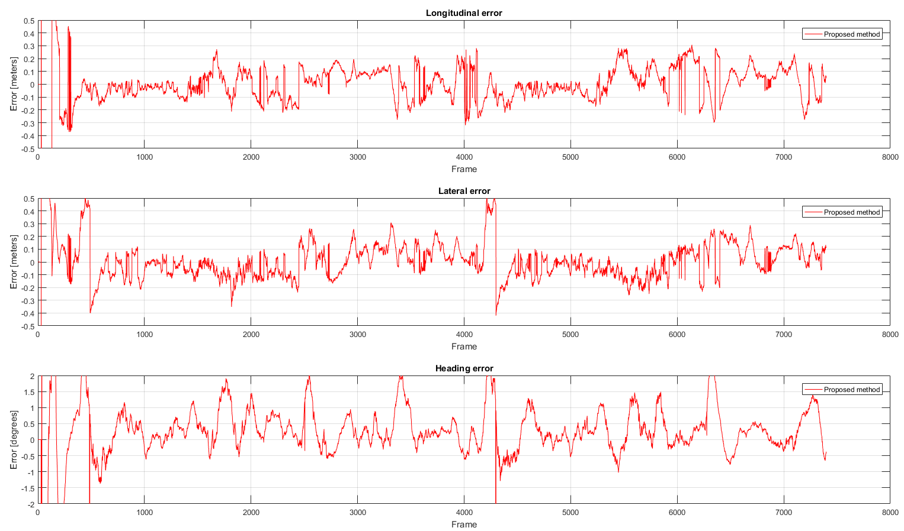

# Elevation Grid Map Based Localization Using LiDAR sensor in Urban Environment

##About Grid Localization
Grid_localization is an elevation grid map based localization solution for urban environments using LiDAR sensor.

Matching step in this project is excuted between 3D point cloud (current measurement) and elevation grid map (reference map), using ICP based on [MRPT](https://www.mrpt.org/).

MRPT-1.5 is required to build the project. See [how to get MRPT on Ubuntu](https://www.mrpt.org/MRPT_in_GNU/Linux_repositories).

You can see DEMO [here](https://www.youtube.com/watch?v=GNgIDupisc4&t=).

Localization result comparison is shown below, I'm to improving the performance.

  

##Main Functions

1.Point cloud generation.

Generate a global point cloud with the trajectory formed form EKF using odometer, imu, and rtk-gps.

2.Elevation grid map generation.

Generate the elevation grid map with the global point cloud. Each grid map covers a 80*80m^2 area and is generated every 20m to ensure there is enough shared area between two grid maps (to ensure the vehicle is located in the central area of each grid map, better for localization).

3.Localization against elevation grid map.

